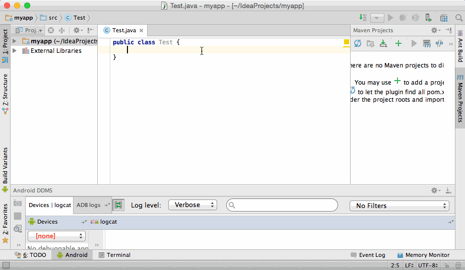

# Hide Tool Windows Ex

Too tired to cmd+shift+F12 (or ctrl+shift+F12)? Use this plugin!
Hide Tool Windows Ex is the plugin to hide tool windows as soon as you start typing.
It also has the functionality to restore the tool windows.



## Installation

Use the IDE's plugin manager to install the latest version of the plugin.

## Usage

To hide/restore selected tool windows
Tools > Hide Tool Windows Ex > Hide/Restore

Select which tool windows should be hidden using
Tools > Hide Tool Windows Ex

* Hide Right Tool Windows
* Hide Left Tool Windows
* Hide Bottom Tool Windows

### Migration

You can migrate default's "Hide All Tool Windows" to "Hide/Restore"

* Remove key map for "Hide All Tool Windows"
* Add the same key map to Plugins > Hide Tool Windows Ex > Hide/Restore

## Contributing

1. Fork it!
2. Create your feature branch: `git checkout -b my-new-feature`
3. Commit your changes: `git commit -am 'Add some feature'`
4. Push to the branch: `git push origin my-new-feature`
5. Submit a pull request

## History

### ver 0.0.1

Initial release

## Size

12 KB

## License

```
The MIT License (MIT)

Copyright (c) 2015 Yoshinori Isogai

Permission is hereby granted, free of charge, to any person obtaining a copy
of this software and associated documentation files (the "Software"), to deal
in the Software without restriction, including without limitation the rights
to use, copy, modify, merge, publish, distribute, sublicense, and/or sell
copies of the Software, and to permit persons to whom the Software is
furnished to do so, subject to the following conditions:

The above copyright notice and this permission notice shall be included in all
copies or substantial portions of the Software.

THE SOFTWARE IS PROVIDED "AS IS", WITHOUT WARRANTY OF ANY KIND, EXPRESS OR
IMPLIED, INCLUDING BUT NOT LIMITED TO THE WARRANTIES OF MERCHANTABILITY,
FITNESS FOR A PARTICULAR PURPOSE AND NONINFRINGEMENT. IN NO EVENT SHALL THE
AUTHORS OR COPYRIGHT HOLDERS BE LIABLE FOR ANY CLAIM, DAMAGES OR OTHER
LIABILITY, WHETHER IN AN ACTION OF CONTRACT, TORT OR OTHERWISE, ARISING FROM,
OUT OF OR IN CONNECTION WITH THE SOFTWARE OR THE USE OR OTHER DEALINGS IN THE
SOFTWARE.
```